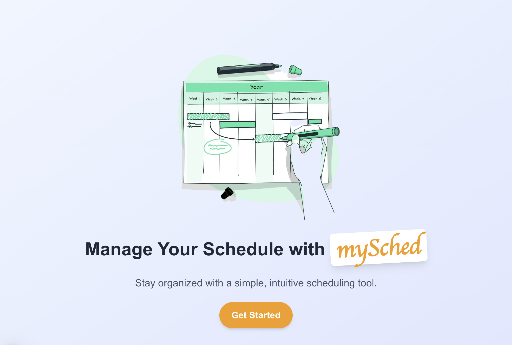
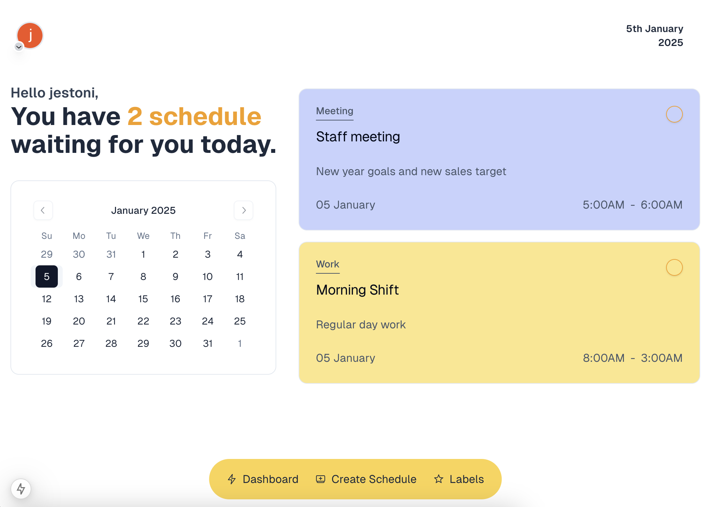

# myShed

Stay organized with a simple, intuitive scheduling web app. This project is made of Next.JS, NextAuth, TypeScript, MySQL, Radix-ui icon, ShadCN UI, TailwindCSS.




### Environment Setup

Create `.env` file

```
NODE_ENV = development
```

Create `.env.local` file

```
APP_NAME=MySched
APP_ENV=development
APP_URL=http://localhost
APP_DOMAIN=localhost

DB_CONNECTION=mysql
DB_HOST=127.0.0.1
DB_PORT=3306
DB_DATABASE=mysched
DB_USERNAME=root
DB_PASSWORD=

NEXTAUTH_SECRET=
NEXTAUTH_URL=http://localhost:3000

GITHUB_ID=
GITHUB_SECRET=

GOOGLE_CLIENT_ID=
GOOGLE_CLIENT_SECRET=
AUTH_SECRET=
```

### Run Docker

`docker-compose up -d`

### MySQL Dump file

Import `mysched_2025-01-02.sql` in your MySQL `mysched` database.

### Access on browser

Open [http://localhost:3000](http://localhost:3000) with your browser to view the mySched web app.

#

Personal project of
[Jestoni Obice](https://jestoni.vercel.app)
